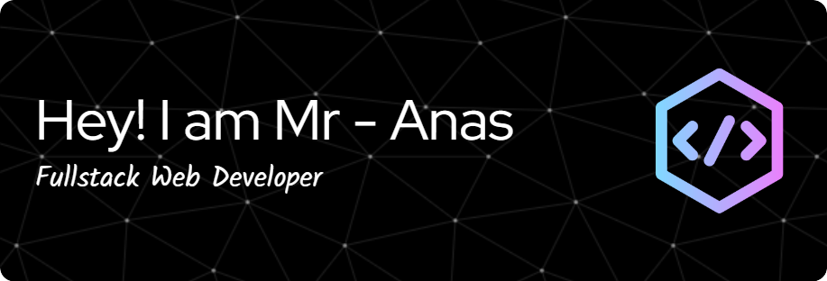

<h1 align="center">Hi 👋, I'm Mr Anas</h1>
<h3 align="center">A passionate Web Development</h3>

  

- 🌱 I’m currently learning **ASP.NET core**

- 👨‍💻 All of my projects are available at [Repositories Section](https://github.com/mranas007?tab=repositories).

- 💬 Ask me about **Front-end | Back-end**

<h3 align="left">Languages and Tools:</h3>

                   

&nbsp;

